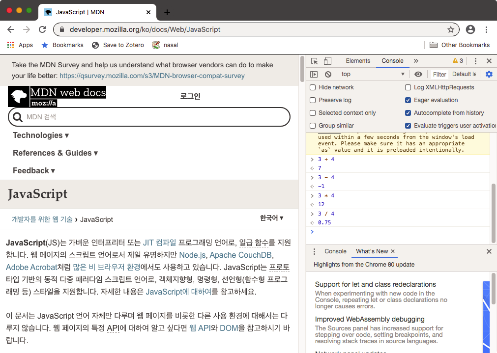

# 웹 프로그래밍 준비

웹 프로그래밍을 위한 준비를 해봅시다. 구글 크롬 웹브라우저가 현재로서는 웹 표준을 가장 잘 지키고 있기 때문에 이것을 기준으로 수업을 진행할 것입니다. 프로그램 소스 코드를 작성하려면 편집기가 필요합니다. 사실 특한 도구가 있어야 하는 것은 아니고 메모장에서 작성해도 됩니다. 다만 좀더 편리하게 코딩을 하기 위해서 프로그래밍 전용 텍스트 에디터를 사용하는 것이 좋습니다. 우리 수업에서는 마이크로소프트사에서 만든 Visual Studio Code를 사용할 것입니다. 이것은 오픈 소스이고 무료로 사용할 수 있습니다. 상용 프로그램인 Visual Studio와 혼동하지 마세요. 전혀 다른 소프트웨어입니다.

* [Google Chrome](https://www.google.com/chrome/) 
* [Visual Studio Code](https://code.visualstudio.com/) 

구글 크롬 웹브라우저를 설치했다면 메뉴에서 개발자 도구\(Developer Tools\)를 찾아 실행해 보세요. 옆에 창이 뜰 것입니다. 개발자 도구 상단에 있는 바에서 콘솔\(Console\)을 선택하세요. 프롬프트\(`>`\)가 뜨고 커서가 깜빡이는 것을 보실 수 있을 것입니다. 프롬프트 옆에 자바스크립트 명령을 쓸 수 있습니다. 간단한 사칙연산 계산을 `+`, `-`, `*`, `/`를 이용해서 할 수 있습니다. 괄호 `()`를 이용하여 먼저 계산할 부분을 나타낼 수도 있습니다. 식을 입력하고 엔터를 치면 결과가 출력됩니다.

## 참고자료

### Web Technology

* [웹](https://ko.wikipedia.org/wiki/월드_와이드_웹)
* [웹 어플리케이션](https://ko.wikipedia.org/wiki/웹_애플리케이션)
* [웹 기술](https://developer.mozilla.org/ko/docs/Web)
* [HTML \(HyperText Markup Language\)](https://ko.wikipedia.org/wiki/HTML)
* [CSS \(Cascading Style Sheet\)](https://ko.wikipedia.org/wiki/종속형_시트)
* [JavaScript](https://ko.wikipedia.org/wiki/자바스크립트)
* [SVG \(Scalable Vector Graphics\)](https://ko.wikipedia.org/wiki/스케일러블_벡터_그래픽스)
* [클라이언트-서버 모델](https://ko.wikipedia.org/wiki/클라이언트_서버_모델)
* [서버 프로그램](https://ko.wikipedia.org/wiki/서버)
* [서버 프로그래밍](https://opentutorials.org/course/669)
* [클라이언트 프로그램](https://ko.wikipedia.org/wiki/클라이언트_%28컴퓨팅%29)
* [클라이턴트 프로그래밍](https://opentutorials.org/course/668)

### Web Standards

* Google Chrome 설치. 구글 크롬을 사용하는 이유? \(웹 표준\)
* [Web standards](https://www.w3.org/standards/)
* [Web Browser Test](https://html5test.com/)
* W3C의 권고안
* HTML5 - W3C에서 2014년 표준안 확정
* CSS3 - W3C 권고안 개발 중
* JavaScript - [ECMA 표준](https://en.wikipedia.org/wiki/ECMAScript)

### JavaScript

* [Programming Language Ranking](https://www.benfrederickson.com/ranking-programming-languages-by-github-users/)
* [Popularity of Programming Language](http://pypl.github.io/)
* [TIOBE Programming Community Index](https://www.tiobe.com/tiobe-index/)
* [JavaScript가 뭔가요?](https://developer.mozilla.org/ko/docs/Learn/JavaScript/First_steps/What_is_JavaScript)
* [자바스크립트 언어 소개](https://opentutorials.org/course/743/4650)
* [실행방법과 실습 환경](https://opentutorials.org/course/743/4646)
* [An Introduction to JavaScript](https://javascript.info/intro)

### Text Editors

* [JavaScript Code Editors](https://javascript.info/code-editors)
* [Best Code Editors](https://www.creativebloq.com/advice/5-top-code-editors-for-programmers)

### Node

* [Node.js](https://nodejs.org/ko/)

